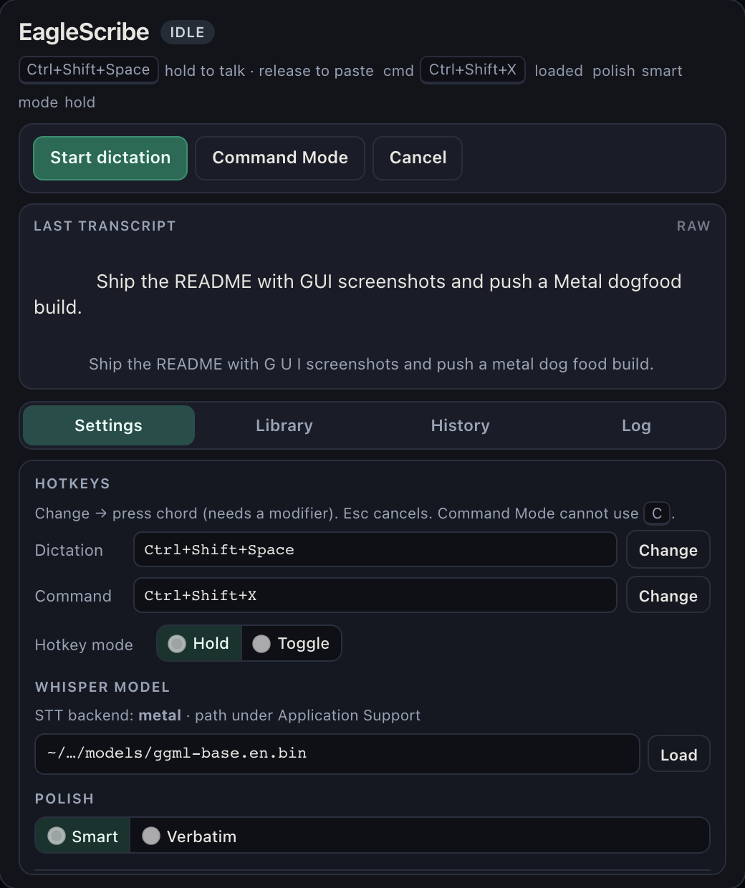

# EagleScribe

Local-first voice dictation for **macOS** and **Linux**. Speak → on-device Whisper transcription → paste into the focused app. No cloud required.

<p align="center">
  
</p>

**Backlog & orientation:** [GitHub issues](https://github.com/hens0n/eaglescribe/issues) · behavior specs and ADRs under [`research/`](./research/) · requirements: [`research/requirements-local-app.md`](./research/requirements-local-app.md) · stack: [`research/stack-decision.md`](./research/stack-decision.md).

**License:** [MIT](./LICENSE)

## Stack

| Layer | Choice |
| --- | --- |
| Language | Rust |
| Shell | Tauri 2 |
| STT | whisper.cpp (`whisper-rs`) |
| Offline polish | Rules in `polish.rs` (fillers, punct, backtrack, lists) |
| Command Mode LLM | Local OpenAI-compatible HTTP (Ollama / llama-server) |
| Hotkey | Rebindable in UI (defaults: `Ctrl+Shift+Space` dictation, `Ctrl+Shift+X` Command Mode) |

See [research/stack-decision.md](./research/stack-decision.md).

## Prerequisites

- **Rust** (stable)
- **Node.js** 20+
- **cmake**, a C/C++ toolchain (for whisper.cpp)
- macOS: Xcode CLT; grant **Microphone** (and later Accessibility for paste reliability)
- Linux: `libasound2-dev` / PipeWire libs as needed for `cpal`; for X11 paste/hotkey stack also `libxdo-dev` / `libxdo` (or distro equivalents — see [Linux hotkeys & paste](#linux-hotkeys--paste-x11-vs-wayland))

## Quick start

```bash
# 1. JS deps
npm install

# 2. Download a small English Whisper model (~140MB)
npm run model:download

# 3. Run the desktop app (CPU STT by default)
npm run desktop
```

Optional: point at any ggml model (models are **not** bundled into the app):

```bash
export EAGLESCRIBE_WHISPER_MODEL=/path/to/ggml-small.en.bin
npm run desktop
```

On **Apple Silicon**, use the Metal dogfood build for faster STT (see [Packaging](#packaging-macos-unsigned-dogfood) below). Day-to-day `npm run desktop` stays CPU so contributors are not surprised.

## Packaging (macOS unsigned dogfood)

macOS is the first-class dogfood path. Builds are **unsigned** (ad-hoc / no Developer ID or notarization yet). **GitHub Actions** (`.github/workflows/release.yml`) builds and attaches packages on version tags (`v*`) and manual `workflow_dispatch` — macOS Apple Silicon **Metal** + Linux x64.

**macOS floor:** release builds (`desktop:build` / `desktop:build:metal`) set `bundle.macOS.minimumSystemVersion` to **10.15** so whisper.cpp can use `std::filesystem` (Tauri’s default was 10.13 and fails to compile current whisper-rs). The resulting app requires **macOS 10.15+**.

### CPU build (default)

Stays free of Metal/CUDA toolkits beyond the usual cmake / C++ baseline:

```bash
npm run desktop:build
```

### Metal dogfood build (Apple Silicon)

Preferred for real use on Apple Silicon so Whisper matches the latency goal direction. Requires Xcode CLT (already a prerequisite). **Switching acceleration always requires a rebuild** — there is no Settings toggle for Metal/CUDA/Vulkan.

```bash
npm run desktop:build:metal
```

Equivalent under the hood: `tauri build --features metal` (Cargo feature `metal` → `whisper-rs/metal`).

| When | Which script |
| --- | --- |
| General contrib / CI-friendly / Intel Mac | `npm run desktop:build` (CPU) |
| Apple Silicon dogfood / lower STT latency | `npm run desktop:build:metal` |
| Day-to-day `tauri dev` | `npm run desktop` (CPU default) |

Dev with Metal (optional): `npm run desktop -- --features metal` or `cd src-tauri && cargo run --features metal`.

### Where the artifacts land

After a successful `tauri build` (CPU or Metal), Tauri 2 writes under `src-tauri/target/release/bundle/`:

| Artifact | Typical path |
| --- | --- |
| **`.app`** | `src-tauri/target/release/bundle/macos/EagleScribe.app` |
| **`.dmg`** | `src-tauri/target/release/bundle/dmg/EagleScribe_<version>_<arch>.dmg` (e.g. `EagleScribe_0.1.1_aarch64.dmg`) |

Open the `.app` from Finder or install from the `.dmg`. Product name / identifier come from `src-tauri/tauri.conf.json` (`EagleScribe` / `ai.eaglescribe.app`).

### Gatekeeper (unsigned apps)

macOS may block or quarantine unsigned builds. For a **technical dogfooder**:

1. **Right-click → Open** the `.app` (or the app inside the `.dmg`), then confirm **Open** in the dialog. First launch often needs this instead of a normal double-click.
2. If macOS still refuses: clear the quarantine flag, then open again:
   ```bash
   xattr -dr com.apple.quarantine /path/to/EagleScribe.app
   open /path/to/EagleScribe.app
   ```
3. **System Settings → Privacy & Security** may show a blocked-app notice with an **Open Anyway** control after a failed launch.

This is expected until we add signing/notarization (out of scope for now). Do not expect App Store distribution from these scripts.

### Models are not in the bundle

The `.app` / `.dmg` does **not** need to embed `ggml-*.bin` weights. Load models the same way as in dev:

- **Load** in the UI after placing a model under `models/` (repo checkout) or any path you choose
- `npm run model:download` (small English model into `models/`)
- `EAGLESCRIBE_WHISPER_MODEL=/path/to/ggml-….bin`

You can copy a model next to the installed app or keep it in a shared folder; path / env / download story is unchanged.

### Smoke check (Metal dogfood)

After `npm run desktop:build:metal`, open `EagleScribe.app`, load a model, and run one dictation. STT should work as on CPU; Metal only changes the compiled Whisper backend (faster on Apple Silicon when the feature is linked).

## Linux packaging (contributor notes)

macOS remains first-class for day-to-day dogfood, but **release CI also ships Linux x64** packages (`.deb` / AppImage / `.rpm` when Tauri produces them) on each version tag. Local contributor builds:

```bash
npm run desktop:build
```

Requires the [Prerequisites](#prerequisites) (cmake, ALSA/PipeWire, etc.). Artifacts land under `src-tauri/target/release/bundle/`.

### Linux hotkeys & paste (X11 vs Wayland)

Behavior contract: [`research/linux-hotkey-paste-spec.md`](./research/linux-hotkey-paste-spec.md).

Global hotkeys use `tauri-plugin-global-shortcut` → **`global-hotkey` (X11 grabs on Linux)**. Simulated paste uses **enigo** (X11 / `libxdo`). **Pure Wayland global hotkeys are not guaranteed** with the current stack — do **not** expect (or advertise) full Wayland global-hotkey parity until re-verified after an upstream change (e.g. portal support in `global-hotkey`).

#### Check your session

```bash
echo $XDG_SESSION_TYPE
# x11      → committed hard path (hotkeys + paste when deps present)
# wayland  → best-effort; see recommendation below
```

#### Recommendation (daily-driver reliability)

| Prefer | When |
| --- | --- |
| **X11 session** (native Xorg / “GNOME on Xorg” / XFCE X11, etc.) | You want global hotkeys and simulated paste to work reliably today |
| **Pure Wayland** | Accept **UI Start/Stop/Cancel** as the primary control surface and **clipboard-only** inject when paste simulation fails (manual `Ctrl+V`) |

| Session | Product commitment |
| --- | --- |
| **X11** | **Hard acceptance:** global hotkeys + simulated paste when packages below are installed |
| **Wayland** (incl. pure) | **Best-effort only.** If hotkey registration fails the app **does not crash** and shows **hotkeys unavailable — use window controls**. Capture → STT → clipboard still works from the window; paste is best-effort |

#### Documented X11 path (Ubuntu / Debian)

Hard gate for contributors and QA: **Ubuntu or Debian on an X11 session** with the packages below. This is the path we commit to for end-to-end dictation on Linux.

**Build** (compile Tauri / enigo X11 backend):

```bash
sudo apt update
sudo apt install -y build-essential cmake pkg-config \
  libasound2-dev libxdo-dev libwebkit2gtk-4.1-dev \
  libayatana-appindicator3-dev librsvg2-dev
```

**Runtime** (inject / paste simulation; often pulled in by `libxdo-dev`, listed explicitly for dogfood machines):

```bash
sudo apt install -y libxdo3
# optional helper tools / peers used by some X11 setups:
# sudo apt install -y xdotool
```

Then verify session and run:

```bash
echo $XDG_SESSION_TYPE   # expect: x11
npm install && npm run model:download && npm run desktop
```

Other families (names may vary by release):

| Family | Packages (indicative) |
| --- | --- |
| Debian/Ubuntu | `libxdo-dev` (build), `libxdo3` (runtime); ALSA/PipeWire for mic (`libasound2-dev`) |
| Fedora | `libX11-devel` `libxdo-devel` (+ cpal/audio deps as needed) |
| Arch | `xdotool` / related (per enigo); base-devel for build |

#### Smoke matrix (implementers / PR notes)

Manual QA matrix lives in the [spec §5](./research/linux-hotkey-paste-spec.md#5-suggested-smoke-matrix-for-implementers--manual-qa). Record results in the PR:

| Gate | Session | Expectation |
| --- | --- | --- |
| **Hard** | **X11** (row 1: GNOME on Xorg / XFCE / etc.) | Hotkey + paste into a native text field (and preferably a browser) all green |
| **Best-effort** | **Wayland** (GNOME / KDE / optional Sway) | Document limits; UI + clipboard path must still work; do not block merge on full hotkey/paste parity |

Minimum for the Linux reliability slice: **X11 hard row green** + honest docs for Wayland rows.

## CUDA / Vulkan (contributor GPU builds)

Cargo features in `src-tauri/Cargo.toml` enable GPU STT backends at **compile time**. They are **not** Settings switches and are not first-class packaging scripts like Metal on macOS.

| Feature | Typical use | Build-time requirement |
| --- | --- | --- |
| `metal` | macOS Apple Silicon | Xcode CLT; use `npm run desktop:build:metal` |
| `cuda` | NVIDIA on Linux | CUDA toolkit installed when building |
| `vulkan` | Portable GPU where whisper-rs supports it | Vulkan SDK / drivers as needed by whisper.cpp |

Examples (pass features through Tauri):

```bash
# NVIDIA (Linux) — toolkit must be present at build time
npm run tauri -- build --features cuda

# Vulkan
npm run tauri -- build --features vulkan
```

Or from the crate: `cd src-tauri && cargo build --release --features cuda` (then bundle separately if needed). Default `desktop:build` stays CPU so contributors without GPU toolkits are not blocked.

## Using the app

1. Complete the first-run **setup checklist** if shown (mic, Accessibility on macOS, Whisper model), or open it anytime from **Settings**.
2. Click **Load** after setting a model path (or point `EAGLESCRIBE_WHISPER_MODEL` / use `npm run model:download`).
3. Choose **Hold to talk** or **Toggle**, and optionally **Change** the global hotkeys (saved locally). Prefer a named mic under **Settings** if you have more than one input.
4. Focus a text field in another app.
5. Use the dictation hotkey (default **Ctrl+Shift+Space**) according to that mode (or the **Start dictation** window button, which always toggles and works when global hotkeys are unavailable).

If paste fails, the text stays on the clipboard — paste manually (`Cmd+V` / `Ctrl+V`). On a **successful** paste, EagleScribe restores your previous clipboard text by default (toggle under **Settings → Clipboard**). Leading/trailing silence trim before Whisper is on by default (**Settings → Silence trim**).

### System tray

EagleScribe stays in the **menu bar** (macOS) or **system tray** (Linux/Windows):

- **Close** the window → hides to tray; global hotkeys keep working when registered (if registration failed, use **Show Window** and in-window controls)
- **Tray glyph** is a dedicated monochrome mark (same asset on macOS / Linux / Windows). On **macOS** it is a system-tinted **template** image; **left-click** restores the window. Linux/Windows show the monochrome asset without macOS template tinting.
- **Right-click** the tray item → **Show Window**, **Hide Window**, **Quit EagleScribe**
- **Dock** click also restores when the window was hidden (macOS; when Dock is present)
- **Menu bar only** (macOS, opt-in under **Settings → Menu bar**, **default off**): hides the Dock icon after the **next launch** (`ActivationPolicy::Accessory`). Tray remains; the main window still shows on launch. After hide/close, restore with **left-click** or **Show Window** only (no Dock). Turning the toggle off and relaunching restores the Dock. Linux/Windows: control is hidden (no dock-hide feature).

## Project layout

```
src/                 # Tauri frontend (settings / status UI)
src-tauri/src/       # Rust core: audio, STT, inject, state
docs/images/         # README screenshots
models/              # ggml weights (gitignored)
research/            # product research + requirements + ADR
scripts/             # model download helper
.github/workflows/   # release CI (macOS Metal + Linux)
```

## Required pull-request gate

Every pull request must pass the platform-independent **Tuning CI** matrix on
both `macos-14` and `ubuntu-22.04`. The two required checks are named
`Tuning semantics (macOS)` and `Tuning semantics (Linux)`.

Both rows run the production corpus, normalizer, Candidate Correction inference,
Personal Dictionary matcher and overlay, Verification Pass scorer, durable
Tuning Session orchestration, recovery, and content-free diagnostics fixtures.
The full-session fixtures cover zero candidates, successful approval and
verification, partial success with an individual rollback, and all rules rolled
back. Privacy sentinels and an explicit unsafe-candidate rejection are assertions,
not updateable output snapshots, so refreshing expected output cannot bless a
Candidate Correction that production inference rejected.

The required commands are:

```bash
npm run build
cargo check --manifest-path src-tauri/Cargo.toml --all-targets --locked
cargo test --manifest-path src-tauri/Cargo.toml --all-targets --locked
```

These deterministic checks do not load Whisper or require microphone hardware;
their behavior must be identical on both operating systems. Shipped-platform
audio replay and release microphone smokes are separate hardware/model gates.

## Polish (smart cleanup)

After STT, **smart** mode (default) runs offline rules:

- Filler removal (`um`, `uh`, `you know`, …)
- Spoken punctuation (`question mark` → `?`)
- Backtrack (`scratch that`, `2 actually 3`)
- **Lists** (`one… two…`, `first… second…`, digit markers, `bullet…`)
- Capitalization + trailing period

Switch to **verbatim** in the UI for raw Whisper output. Raw + polished text both appear in the window after each dictation.

## Dictionary

Add preferred spellings (names, product terms) in the UI. Matching is case-insensitive with word boundaries; longer phrases win. Applied after polish. Stored only on disk under the OS app data dir (`…/eaglescribe/dictionary.json`).

## Snippets

Map a short **cue** to a longer **expansion** (signatures, links, templates). If the whole utterance is the cue (ignoring trailing `.`/`?`), the expansion replaces it. Cues inside a sentence expand in place. Applied after dictionary. File: `…/eaglescribe/snippets.json`.

## What’s next

Specs and stance docs live under [`research/`](./research/). Recent map slices are **implemented** (issues closed); use GitHub issues for new work.

### Shipped (dogfood baseline)

- [x] Deterministic polish (fillers, punctuation, backtrack, lists)
- [x] Personal dictionary + snippets
- [x] Push-to-talk hold / toggle + rebindable hotkeys
- [x] Command Mode via local OpenAI-compatible LLM (Ollama / llama-server)
- [x] System tray, template glyph, reliable Show/left-click restore
- [x] Optional macOS menu-bar-only (hide Dock; next launch)
- [x] Dense tabbed UI + waiting-LLM status
- [x] Transcript history (local; History tab)
- [x] Global Escape cancel while recording
- [x] Clipboard restore after paste (configurable)
- [x] Mic device picker + fallback when preferred is missing
- [x] Leading/trailing silence trim (Settings toggle; default on)
- [x] First-run setup checklist + failure-time permissions help
- [x] Read-only STT acceleration label in Settings
- [x] Unsigned macOS Metal + Linux x64 **release CI** on `v*` tags
- [x] Linux hotkey registration honesty + clipboard ownership notes (X11 hard path; Wayland best-effort)

### Still open / deferred

| Area | Notes |
| --- | --- |
| **Code signing / notarization** | Dogfood builds stay unsigned; Gatekeeper steps still apply ([packaging-spec.md](./research/packaging-spec.md)) |
| **Pure Wayland global hotkeys** | Not guaranteed; UI + clipboard remain the reliable path ([linux-hotkey-paste-spec.md](./research/linux-hotkey-paste-spec.md)) |
| **In-process llama.cpp** | **Deferred** — Command Mode stays HTTP to a local OpenAI-compatible server ([in-process-llm-stance.md](./research/in-process-llm-stance.md)) |
| **Windows first-class dogfood** | Not a current packaging target |

Behavior contracts for shipped slices (mic, tray, silence trim, packaging, Linux, onboarding, Escape cancel) remain in `research/*-spec.md` for regression context.

## Command Mode

1. Run a local LLM server (recommended: [Ollama](https://ollama.com) + `ollama pull llama3.2`).
2. In EagleScribe, set base URL `http://127.0.0.1:11434/v1` and model name, click **Save LLM**.
3. Select text in any app.
4. Hold **Ctrl+Shift+X**, speak an instruction (e.g. “make this more professional”), release.
5. Rewritten text is pasted (selection was copied first via Cmd/Ctrl+C).

Works with any OpenAI-compatible local server (`llama-server`, LM Studio, etc.). Traffic stays on localhost.

## License

[MIT](./LICENSE)
